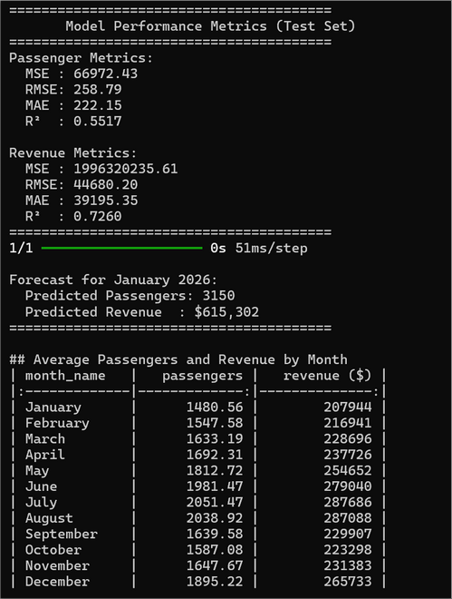
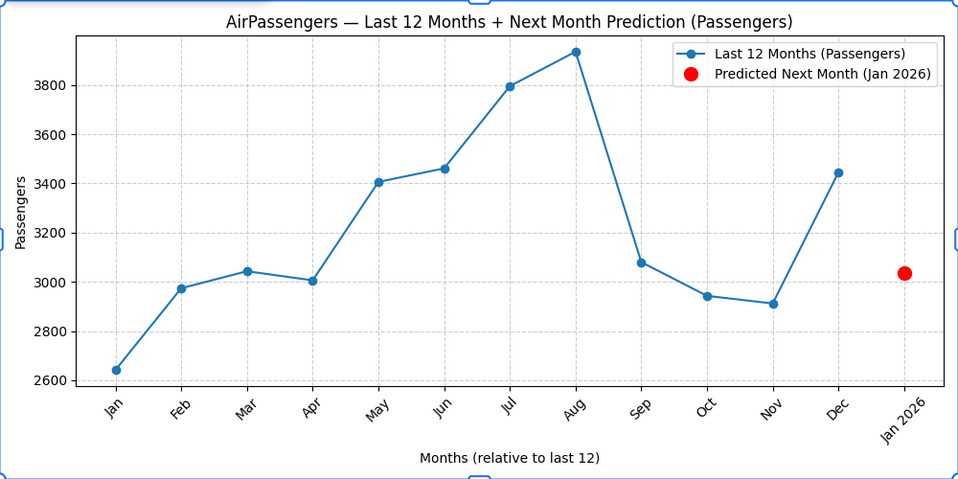

# Automated Data Collection and Visualization: From Web Scraping to Insights

## 📌 Project Overview
This project demonstrates an end-to-end data pipeline that automates **data collection, processing, visualization, and prediction** using Python.  
The system scrapes real-world **flight passenger data**, transforms it into a structured format, visualizes trends, and applies **LSTM-based time series forecasting** to extract meaningful insights.

The focus of this project is on **automation, data reliability, and analytical accuracy**, making it suitable for backend, data engineering, and analytics-oriented roles.

## Installation Steps
1. **Clone the repository**
   ```bash
   git clone https://github.com/your-username/your-repo-name.git
   cd your-repo-name
   ```
2. **Create and activate a virtual environment (optional but recommended)**
    ```bash
    python -m venv venv
    source venv/bin/activate   # On Linux / macOS
    venv\Scripts\activate      # On Windows
    ```
3. **Install required dependancies**
    ```bash
    pip install -r requirements.txt
    ```

## Running the project

# Run the data collection script 
>[!NOTE]
> You can specify the URL of you're specific website but use URL of websites which contains table like structures

``` bash
python app.py
```
---

## 🚀 Features
- Automated web data extraction using **Selenium** and **BeautifulSoup**
- HTML table parsing and conversion to structured datasets
- Persistent storage of scraped data in CSV format
- Data analysis and visualization using Python libraries
- Time-series forecasting using **LSTM (Long Short-Term Memory)**
- End-to-end workflow from raw data to insights

---

## 🛠️ Technologies Used
- **Python**
- **Selenium** – Dynamic web scraping
- **BeautifulSoup** – HTML parsing
- **Pandas** – Data manipulation and preprocessing
- **Matplotlib / Seaborn** – Data visualization
- **TensorFlow / Keras** – LSTM model for prediction

---

## 📊 Dataset
- **Domain:** Flight Passenger Data  
- **Type:** Time-series data  
- **Usage:** Trend analysis and future passenger count prediction

---

## ⚙️ How the Automation Works
1. A local or remote webpage is accessed programmatically.
2. HTML content is fetched using a system command.
3. **BeautifulSoup** parses tabular data from the webpage.
4. Data is converted into a Pandas DataFrame.
5. The processed data is saved as a CSV file.
6. Visualization and LSTM-based prediction are performed on the dataset.

---

## 🧠 Core Script (`app.py`)
The main script handles:
- Fetching HTML data
- Extracting tabular information
- Storing cleaned data for further analysis

```python
import subprocess
from bs4 import BeautifulSoup
import pandas as pd
import os

# Step 1: Get HTML using curl
url = "http://localhost:8080/"
command = ["curl", url]
result = subprocess.run(command, capture_output=True, text=True)
html = result.stdout

# Step 2: Parse with BeautifulSoup
soup = BeautifulSoup(html, "html.parser")

# Step 3: Find the table
table = soup.find("table")
if table:
    headers = [th.get_text(strip=True) for th in table.find_all("th")]
    rows = []
    for tr in table.find_all("tr")[1:]:
        cells = [td.get_text(strip=True) for td in tr.find_all("td")]
        if cells:
            rows.append(cells)

    df = pd.DataFrame(rows, columns=headers)
    print(df)

    os.makedirs("Samples", exist_ok=True)
    df.to_csv("Samples/Companies.csv", index=False)
else:
    print("No table found in HTML")
```

## Results

# Model metrics


#Visual Output



